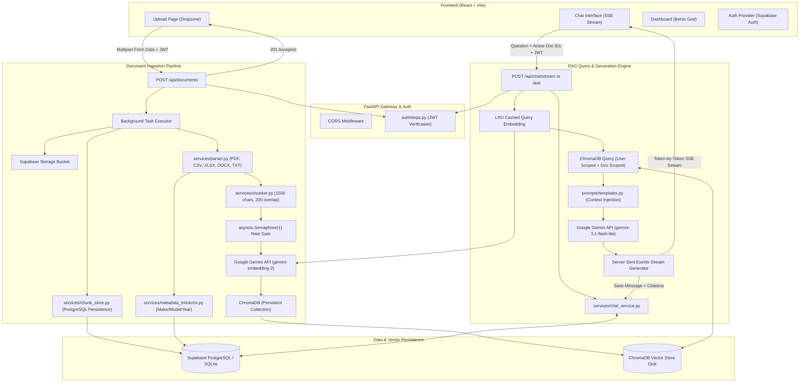

# Auron — Vehicle Intelligence Assistant (Complete System Documentation)

Welcome to the comprehensive technical documentation for **Auron (Vehicle Intelligence Assistant)**. This document provides an exhaustive, production-grade architectural and code-level breakdown of the entire platform, explaining every requirement, design decision, data flow, RAG pipeline component, database schema, backend endpoint, service layer, and frontend interface.

---

## Table of Contents

1. [Executive Summary & High-Level Architecture](#1-executive-summary--high-level-architecture)
2. [End-to-End System Architecture & Data Flow](#2-end-to-end-system-architecture--data-flow)
3. [Deep-Dive: The Retrieval-Augmented Generation (RAG) Engine](#3-deep-dive-the-retrieval-augmented-generation-rag-engine)
   - [3.1 Ingestion & Multi-Format Parsing](#31-ingestion--multi-format-parsing)
   - [3.2 Smart Text Chunking & Capping Strategy](#32-smart-text-chunking--capping-strategy)
   - [3.3 Semantic Embeddings & API Quota Defense](#33-semantic-embeddings--api-quota-defense)
   - [3.4 ChromaDB Vector Indexing & Cosine Space](#34-chromadb-vector-indexing--cosine-space)
   - [3.5 Multi-Tenant User Isolation in Vector Space](#35-multi-tenant-user-isolation-in-vector-space)
   - [3.6 Retrieval, Scoping & Similarity Scoring](#36-retrieval-scoping--similarity-scoring)
   - [3.7 Grounded Prompt Engineering & Anti-Hallucination](#37-grounded-prompt-engineering--anti-hallucination)
   - [3.8 Real-Time Server-Sent Events (SSE) Streaming](#38-real-time-server-sent-events-sse-streaming)
   - [3.9 Dual-Storage Chunk Persistence & Zero-Data-Loss Recovery](#39-dual-storage-chunk-persistence--zero-data-loss-recovery)
4. [Backend File-by-File Technical Breakdown](#4-backend-file-by-file-technical-breakdown)
   - [4.1 Entry Point & Configuration](#41-entry-point--configuration)
   - [4.2 Security & Authentication Layer](#42-security--authentication-layer)
   - [4.3 API Route Controllers](#43-api-route-controllers)
   - [4.4 Core Business Logic & Services](#44-core-business-logic--services)
   - [4.5 Database Models & Persistence Layer](#45-database-models--persistence-layer)
   - [4.6 Database Schemas & Migrations](#46-database-schemas--migrations)
5. [Frontend File-by-File Technical Breakdown](#5-frontend-file-by-file-technical-breakdown)
   - [5.1 Routing, App Shell & Layouts](#51-routing-app-shell--layouts)
   - [5.2 State Management & Auth Context](#52-state-management--auth-context)
   - [5.3 API Interceptors & Custom Hooks](#53-api-interceptors--custom-hooks)
   - [5.4 Page Components](#54-page-components)
   - [5.5 Landing Page & Visual Experience Components](#55-landing-page--visual-experience-components)
   - [5.6 Core UI Component System](#56-core-ui-component-system)
6. [Interactive User Journeys & End-to-End Pipelines](#6-interactive-user-journeys--end-to-end-pipelines)
7. [Production Resilience, Quotas & Deployment Strategy](#7-production-resilience-quotas--deployment-strategy)

---

## 1. Executive Summary & High-Level Architecture

**Auron** is an enterprise-grade, automotive-specialized Retrieval-Augmented Generation (RAG) platform. It allows vehicle owners, fleet managers, and automotive technicians to upload technical vehicle manuals, maintenance logs, inspection reports, and service bulletins in diverse formats (`.pdf`, `.xlsx`, `.csv`, `.docx`, `.txt`), automatically indexes their semantic knowledge, and enables conversational question answering powered by **Google Gemini** with source citations.

### Tech Stack Overview

| Domain | Technology | Purpose & Implementation Details |
| :--- | :--- | :--- |
| **Backend Framework** | **FastAPI (Python 3.11+)** | High-performance asynchronous API framework with native Pydantic validation, background task orchestration, and SSE streaming. |
| **LLM & Generation** | **Google Gemini (`gemini-3.1-flash-lite`)** | Low-latency, high-accuracy conversational AI grounded exclusively in retrieved document context. |
| **Vector Embeddings** | **Google Gemini (`gemini-embedding-2`)** | 3072-dimensional dense vector embeddings generated via Gemini API (zero local model RAM footprint). |
| **Vector Database** | **ChromaDB (Persistent)** | On-disk HNSW index with cosine distance metric for fast semantic similarity search. |
| **Primary Database** | **Supabase PostgreSQL / SQLite fallback** | Relational metadata store for users, profiles, preferences, documents, chunks, conversations, and messages. |
| **Object Storage** | **Supabase Storage** | Cloud bucket storage for uploaded raw document files with local disk fallback. |
| **Authentication** | **Supabase Auth + JWT** | Email/password, Google OAuth, and Anonymous guest sessions with backend JWT verification. |
| **Frontend Core** | **React 18 + Vite** | Modern client-side SPA with React Router v6, Lucide icons, and React Markdown. |
| **Styling & Aesthetics** | **TailwindCSS + Custom Glassmorphism** | Dark-mode-first luxury aesthetic with ambient lighting, backdrop blur, bento grids, and smooth micro-animations. |
| **Deployment** | **Render / Docker** | Containerized backend web service + static site frontend with Nginx SPA routing. |

---

## 2. End-to-End System Architecture & Data Flow



---

## 3. Deep-Dive: The Retrieval-Augmented Generation (RAG) Engine

The RAG engine is the core intelligence system of Auron. It bridges the gap between raw, unstructured automotive documents and accurate, context-grounded AI responses.

### 3.1 Ingestion & Multi-Format Parsing
Located in [`backend/app/services/parser.py`](file:///Users/user/Desktop/Internship%20Project/backend/app/services/parser.py).

The platform ingests files across five distinct formats without requiring external microservices:
1. **PDF (`.pdf`)**: Parsed page-by-page using `pypdf.PdfReader`. Text from each page is extracted and joined with double newlines while tracking the total page count.
2. **CSV (`.csv`)**: Evaluated through multi-encoding decoding (`utf-8`, `utf-8-sig`, `latin-1`, `cp1252`). Merged/unnamed columns are stripped (`^Unnamed`), and rows are transformed into clear `"Column: Value"` semantic sentences.
3. **Excel (`.xlsx`)**: Evaluated sheet-by-sheet using `pandas`. Reads sheets with `header=None` to avoid unmerged title cell distortion, converting rows into pipe-separated (`val1 | val2 | val3`) textual lines with explicit sheet headers (`=== Sheet: SheetName ===`).
4. **Word Documents (`.docx`)**: Parsed via `python-docx` traversing paragraphs and tabular grid structures row-by-row with pipe delimiters.
5. **Plain Text (`.txt`)**: Multi-encoding fallback with `errors='replace'` fallback guarantee.

#### Automated Vehicle Metadata Extraction
Located in [`backend/app/services/metadata_extractor.py`](file:///Users/user/Desktop/Internship%20Project/backend/app/services/metadata_extractor.py).
During parsing, the first 4,000 characters are scanned with regex patterns against a curated dictionary of 50+ global manufacturers (Toyota, Honda, Tata, Hyundai, BMW, Mercedes, Tesla, etc.) to extract make, model, and manufacturing year (e.g., `"Tata Nexon 2024"`).

---

### 3.2 Smart Text Chunking & Capping Strategy
Located in [`backend/app/services/chunker.py`](file:///Users/user/Desktop/Internship%20Project/backend/app/services/chunker.py).

* **Splitter**: `RecursiveCharacterTextSplitter` from LangChain.
* **Chunk Size**: `1500` characters (~375 tokens).
* **Chunk Overlap**: `200` characters (~50 tokens).
* **Splitting Hierarchy**: `["\n\n", "\n", " ", ""]` (splits on paragraphs first, then sentences, then words).
* **Quota-Defending Cap**: Hard-capped at `200` chunks per document (`max_chunks_per_doc = 200`). This ensures a massive 500-page manual cannot consume the user's entire daily Gemini API quota in a single upload.

---

### 3.3 Semantic Embeddings & API Quota Defense
Located in [`backend/app/services/vector_store.py`](file:///Users/user/Desktop/Internship%20Project/backend/app/services/vector_store.py).

* **Model**: `gemini-embedding-2` via Google GenAI SDK.
* **Embedding Dimensions**: `3072` dimensions.
* **Zero Local RAM Overhead**: Offloads all dense vector calculation to Gemini API, keeping backend memory footprint under ~120 MB (safe for Render's 512 MB free tier).
* **Batching Architecture**: Chunks are processed in batches of `100` (`EMBED_BATCH_SIZE = 100`), which is the maximum payload supported by Gemini API.
* **Inter-Batch Throttle**: `0.7s` sleep between batches (`EMBED_INTER_BATCH_DELAY`) to guarantee API calls stay below the 100 requests-per-minute (RPM) limit.
* **Concurrency Gate**: Global `asyncio.Semaphore(1)` in [`documents.py`](file:///Users/user/Desktop/Internship%20Project/backend/app/routes/documents.py) serializes background embedding jobs across concurrent uploads.
* **Error Resilience & Retry Strategy**:
  - **RPD (Daily Quota, 1000 requests/day)**: Detects `EmbedContentRequestsPerDay` exhaustion and fails fast immediately with a user-friendly error message indicating reset time (12:30 PM IST).
  - **RPM/TPM (Per-Minute Quota, 429)**: Parses Gemini's `retryDelay` response parameter and uses exponential backoff with jitter up to `65s`.
  - **Network/Transport Dropped Connections**: Automatic retry on `StreamClosedError`, `HTTP/2 GOAWAY`, or connection timeouts.
* **LRU Cached Query Embeddings**: Uses `@functools.lru_cache(maxsize=128)` on query embeddings so repeated questions in a chat session don't consume extra embedding API calls.

---

### 3.4 ChromaDB Vector Indexing & Cosine Space
Located in [`backend/app/services/vector_store.py`](file:///Users/user/Desktop/Internship%20Project/backend/app/services/vector_store.py).

* **Engine**: `chromadb.PersistentClient` located at `./data/chroma`.
* **Space Metric**: Cosine distance (`hnsw:space: cosine`).
* **Chunk ID Scheme**: `{document_id}_{chunk_index}`.
* **Stored Metadata**:
  ```json
  {
    "document_id": "uuid-here",
    "user_id": "uuid-here",
    "chunk_index": 0,
    "original_filename": "Tata_Nexon_Manual.pdf",
    "file_type": "pdf"
  }
  ```

---

### 3.5 Multi-Tenant User Isolation in Vector Space
To ensure that User A cannot retrieve or view chunks belonging to User B:
1. Every chunk added to ChromaDB is tagged with the authenticated user's `user_id`.
2. When searching ChromaDB, a `$where` filter is dynamically constructed:
   - **User-wide search**: `where={"user_id": user_id}`
   - **Single document scoped**: `where={"$and": [{"user_id": user_id}, {"document_id": doc_id}]}`
   - **Multi-document scoped**: `where={"$and": [{"user_id": user_id}, {"document_id": {"$in": [doc_id1, doc_id2]}}]}`

---

### 3.6 Retrieval, Scoping & Similarity Scoring
Located in [`backend/app/services/rag_service.py`](file:///Users/user/Desktop/Internship%20Project/backend/app/services/rag_service.py).

* **Top-K Retrieval**: Fetches top `5` most relevant chunks (`top_k_results = 5`).
* **Relevance Score Normalization**:
  $$\text{Relevance Percentage} = \text{round}((1.0 - \text{cosine\_distance}) \times 100)\%$$
* **Deduplicated Citations**: Formats citations into `SourceCitation` objects, grouping by unique source document names with page references and similarity scores.

---

### 3.7 Grounded Prompt Engineering & Anti-Hallucination
Located in [`backend/app/prompts/templates.py`](file:///Users/user/Desktop/Internship%20Project/backend/app/prompts/templates.py).

* **System Instruction (`VEHICLE_ASSISTANT_SYSTEM_PROMPT`)**:
  Instructs Gemini that it is an expert Vehicle Assistant whose **ONLY** source of knowledge is the provided document context. If the answer is not present in the chunks, it is strictly forbidden from making up specifications and must reply:
  > *"I don't have enough information in the uploaded documents to answer this question. Please upload relevant vehicle manuals or maintenance records."*
* **Context Assembly (`build_rag_prompt`)**:
  Structures retrieved chunks into a numbered context block:
  ```text
  DOCUMENT CONTEXT:
  [Source 1: Tata_Nexon_Manual.pdf | Relevance: 94%]
  Engine Oil Grade: SAE 5W-40. Capacity: 3.8 litres. Change every 10,000 km.
  ---
  [Source 2: Vehicle_Safety_Checklist.txt | Relevance: 82%]
  Check oil level with engine cold, on level ground.
  ---
  QUESTION: What oil should I use for my Nexon and what is the capacity?
  INSTRUCTION: Answer using ONLY the document context provided.
  ```

---

### 3.8 Real-Time Server-Sent Events (SSE) Streaming
Located in [`backend/app/routes/chat.py`](file:///Users/user/Desktop/Internship%20Project/backend/app/routes/chat.py).

* **Endpoint**: `POST /api/chat/stream`
* **Transport**: HTTP streaming with `text/event-stream` media type and `X-Accel-Buffering: no` header to bypass Nginx proxy buffering.
* **Token Emission**: As Gemini yields tokens asynchronously via `models.generate_content_stream()`, the server emits:
  ```http
  data: {"token": "The "}
  data: {"token": "recommended "}
  data: {"token": "oil "}
  ```
* **Completion Event**:
  ```http
  data: {"done": true, "sources": [{"document_name": "Tata_Nexon_Manual.pdf", "relevance_score": 0.94}], "full_answer": "..."}
  ```
* **Persistence Event**: Saves the full user and assistant message to the database and emits:
  ```http
  data: {"saved": true, "message_id": "uuid", "conversation_id": "uuid"}
  ```

---

### 3.9 Dual-Storage Chunk Persistence & Zero-Data-Loss Recovery
Located in [`backend/app/services/chunk_store.py`](file:///Users/user/Desktop/Internship%20Project/backend/app/services/chunk_store.py).

Because free-tier host environments (such as Render ephemeral disks) can wipe disk storage on sleep or restart:
1. **PostgreSQL Persistence**: Every extracted text chunk is permanently inserted into the `document_chunks` relational table in Supabase.
2. **Auto-Rebuild on Boot**: During startup in [`main.py`](file:///Users/user/Desktop/Internship%20Project/backend/app/main.py), if the ChromaDB vector count is `0`, the server automatically queries all `ready` documents from `document_chunks`, regenerates embeddings with throttling, and repopulates the ChromaDB index without requiring users to re-upload their files.

---

## 4. Backend File-by-File Technical Breakdown

```
backend/
├── app/
│   ├── auth/
│   │   └── deps.py
│   ├── models/
│   │   ├── database.py
│   │   ├── schemas.py
│   │   └── supabase_database.py
│   ├── prompts/
│   │   └── templates.py
│   ├── routes/
│   │   ├── auth.py
│   │   ├── chat.py
│   │   └── documents.py
│   ├── services/
│   │   ├── chat_service.py
│   │   ├── chunk_store.py
│   │   ├── chunker.py
│   │   ├── document_service.py
│   │   ├── metadata_extractor.py
│   │   ├── parser.py
│   │   ├── rag_service.py
│   │   ├── supabase_client.py
│   │   └── vector_store.py
│   ├── utils/
│   │   └── logging.py
│   ├── config.py
│   └── main.py
├── supabase_schema.sql
├── supabase_schema_v2.sql
├── supabase_schema_v3.sql
└── requirements.txt
```

### 4.1 Entry Point & Configuration

#### `backend/app/config.py`
* **Purpose**: Centralized application settings using `pydantic-settings.BaseSettings`.
* **Key Configuration Fields**:
  - `allowed_origins`: Comma-separated list for CORS (`localhost:5173`, `auron-vehicle-ai.onrender.com`).
  - `supabase_url`, `supabase_service_role_key`, `supabase_jwt_secret`, `supabase_storage_bucket`.
  - `gemini_api_key`, `gemini_llm_model` (`gemini-3.1-flash-lite`), `gemini_embedding_model` (`gemini-embedding-2`).
  - `chunk_size` (1500), `chunk_overlap` (200), `top_k_results` (5), `max_chunks_per_doc` (200).
* **Caching**: Wrapped in `@lru_cache()` via `get_settings()`.

#### `backend/app/main.py`
* **Purpose**: FastAPI application factory and lifecycle orchestrator (`lifespan`).
* **Startup Sequence**:
  1. Configures structured logging.
  2. Connects to Supabase PostgREST (or falls back to SQLite).
  3. Verifies Supabase Storage bucket readiness.
  4. Recovers documents stuck in `processing` state across server restarts.
  5. Registers CORS middleware with `allow_credentials=True`.
  6. Attaches global exception handlers (404, 422, 500) and mounts `/api/documents`, `/api/chat`, `/api/auth`.
  7. Exposes `/health` endpoint returning database and document counts.

---

### 4.2 Security & Authentication Layer

#### `backend/app/auth/deps.py`
* **Purpose**: Verifies Supabase-issued JSON Web Tokens (JWT) on incoming HTTP requests.
* **Mechanisms**:
  - `get_current_user(request)`: Extracts `Authorization: Bearer <token>`, decodes HMAC-SHA256 signature using `SUPABASE_JWT_SECRET`, and returns the user's UUID (`sub` claim). Returns `None` if unauthenticated.
  - `require_user(user_id)`: Enforces authentication, raising HTTP 401 Unauthorized if `user_id` is missing.

---

### 4.3 API Route Controllers

#### `backend/app/routes/documents.py`
* **Endpoints**:
  - `POST /api/documents`: Accepts file upload, saves file, creates DB record in `processing` status, and enqueues background processing task.
  - `GET /api/documents`: Returns list of documents filtered by status (`ready`, `processing`, `error`) and scoped to the user.
  - `GET /api/documents/stats`: Returns total, ready, processing, error counts, total chunks, and storage bytes.
  - `GET /api/documents/{id}`: Returns document metadata.
  - `GET /api/documents/{id}/status`: Lightweight endpoint for polling document processing state.
  - `GET /api/documents/{id}/preview`: Returns first 800 characters of extracted text for UI inspection.
  - `DELETE /api/documents/{id}`: Deletes vectors from ChromaDB, deletes file from Supabase Storage, and removes database record.
* **Background Worker (`_process_document`)**:
  Uploads to Supabase Storage $\rightarrow$ parses text $\rightarrow$ chunks text $\rightarrow$ caps chunks $\rightarrow$ acquires embedding semaphore $\rightarrow$ generates embeddings and inserts to ChromaDB $\rightarrow$ persists chunks to database $\rightarrow$ extracts vehicle make/model $\rightarrow$ updates status to `ready`.

#### `backend/app/routes/chat.py`
* **Endpoints**:
  - `POST /api/chat/ask`: Synchronous RAG endpoint (retrieves chunks, prompts Gemini, saves turn, returns answer + citations).
  - `POST /api/chat/stream`: Real-time SSE streaming RAG endpoint yielding incremental tokens and final source metadata.
  - `GET /api/chat/conversations`: Lists conversations ordered by `updated_at DESC`.
  - `POST /api/chat/conversations`: Creates a new conversation thread.
  - `GET /api/chat/conversations/{id}`: Retrieves conversation details.
  - `PATCH /api/chat/conversations/{id}`: Renames conversation title.
  - `DELETE /api/chat/conversations/{id}`: Deletes conversation and cascades to messages.
  - `GET /api/chat/conversations/{id}/messages`: Fetches chronological message history.
  - `PATCH /api/chat/messages/{id}/rating`: Records user feedback (+1 thumbs up, -1 thumbs down, or null).
  - `GET /api/chat/analytics`: Computes query metrics, satisfaction rate, and top cited documents.
  - `GET /api/chat/conversations/{id}/export`: Generates and streams a downloadable Markdown (`.md`) transcript of the conversation.

#### `backend/app/routes/auth.py`
* **Endpoints**:
  - `POST /api/auth/initialize-user`: Triggered on new user sign-up. Idempotently seeds 3 complete demo automotive manuals (Tata Nexon, Hyundai Creta, Vehicle Safety Checklist) and runs them through the ingestion pipeline.
  - `DELETE /api/auth/delete-account`: Purges all user data in order (disk files $\rightarrow$ Supabase storage $\rightarrow$ ChromaDB vectors $\rightarrow$ conversations $\rightarrow$ documents $\rightarrow$ Supabase `auth.users` row).

---

### 4.4 Core Business Logic & Services

#### `backend/app/services/rag_service.py`
* **Purpose**: Orchestrates retrieval and LLM answer generation.
* **Key Functions**:
  - `answer(...)`: Standard single-turn/multi-turn RAG execution.
  - `answer_stream(...)`: Async generator yielding SSE tokens from `generate_content_stream`.
  - `_build_citations(...)`: Converts vector distance to percentage relevance and removes duplicate document references.
  - `_build_gemini_contents(...)`: Reconstructs conversation history (last 10 turns) into Gemini `types.Content` objects.

#### `backend/app/services/vector_store.py`
* **Purpose**: Manages ChromaDB collections and Gemini embeddings.
* **Key Functions**:
  - `add_chunks(...)`: Batches text in 100s, calls `_get_embeddings()`, and adds vectors to ChromaDB with user metadata.
  - `search(...)`: Generates query embedding and runs cosine similarity search with user-scoping and document-scoping filters.
  - `delete_chunks(...)`: Removes all vectors matching a `document_id`.

#### `backend/app/services/parser.py`
* **Purpose**: Format-agnostic text extraction from files.
* **Methods**: `_parse_pdf`, `_parse_csv`, `_parse_excel`, `_parse_docx`, `_parse_txt`.

#### `backend/app/services/chunker.py`
* **Purpose**: LangChain recursive character splitter configured with custom chunk size and overlap.

#### `backend/app/services/metadata_extractor.py`
* **Purpose**: Regex pattern matcher for automotive manufacturer and vehicle model identification.

#### `backend/app/services/document_service.py`
* **Purpose**: Database CRUD operations for document entities, aggregation statistics, and polling checks.

#### `backend/app/services/chat_service.py`
* **Purpose**: Database CRUD operations for conversations, messages, feedback ratings, and analytics aggregations.

#### `backend/app/services/chunk_store.py`
* **Purpose**: Manages permanent relational chunk storage in `document_chunks` table and orchestrates ChromaDB rebuilds on boot.

#### `backend/app/services/supabase_client.py`
* **Purpose**: Interacts with Supabase Storage bucket (`upload_file_to_storage`, `delete_file_from_storage`).

---

### 4.5 Database Models & Persistence Layer

#### `backend/app/models/schemas.py`
* **Purpose**: Pydantic v2 validation models for all API requests and responses:
  - `DocumentResponse`, `DocumentListResponse`, `DocumentStatusResponse`, `DocumentStats`, `DocumentPreviewResponse`.
  - `ChatRequest`, `ChatResponse`, `SourceCitation`.
  - `ConversationResponse`, `MessageResponse`, `RatingUpdate`, `AnalyticsResponse`.

#### `backend/app/models/database.py`
* **Purpose**: Abstract Database interface with SQLite implementation using `aiosqlite`.

#### `backend/app/models/supabase_database.py`
* **Purpose**: Concrete implementation of the Database interface executing queries against Supabase PostgreSQL via PostgREST.

---

### 4.6 Database Schemas & Migrations

#### `backend/supabase_schema_v2.sql` & `supabase_schema_v3.sql`
Defines relational tables with Foreign Keys and Row Level Security (RLS):
1. `profiles`: `id` (UUID references auth.users), `email`, `display_name`, timestamps.
2. `documents`: `id` (UUID), `user_id` (UUID), `filename`, `original_filename`, `file_type`, `file_size`, `file_path`, `storage_path`, `status`, `chunk_count`, `page_count`, `vehicle_name`, `manufacturer`, `error_message`, timestamps.
3. `document_chunks`: `id` (UUID), `document_id` (UUID references documents), `chunk_index`, `chunk_text`, `metadata` (JSON), timestamps.
4. `conversations`: `id` (UUID), `user_id` (UUID), `title`, timestamps.
5. `messages`: `id` (UUID), `conversation_id` (UUID references conversations), `role` (`user` | `assistant`), `content`, `sources` (JSON), `rating` (integer), timestamps.
6. `user_preferences`: `user_id` (UUID), `vehicle_make`, `vehicle_model`, `vehicle_variant`, `vehicle_year`, `fuel_type`, `transmission`, `driving_preference`, `response_style`, `notification_enabled`, timestamps.

---

## 5. Frontend File-by-File Technical Breakdown

```
frontend/src/
├── api/
│   └── axios.js
├── assets/
│   ├── hero.png
│   └── vite.svg
├── components/
│   ├── landing/
│   │   ├── AboutAuron.jsx
│   │   ├── AuronFeatures.jsx
│   │   ├── CinematicSection.jsx
│   │   ├── FinalCTA.jsx
│   │   ├── HowAuronWorks.jsx
│   │   ├── MeetAuron.jsx
│   │   └── MotionButton.jsx
│   ├── layout/
│   │   ├── HistoryDrawer.jsx
│   │   ├── Sidebar.jsx
│   │   └── TopNav.jsx
│   ├── ui/
│   │   ├── card.jsx
│   │   ├── chatgpt-prompt-input.tsx
│   │   ├── ErrorState.jsx
│   │   ├── featuresgrid.tsx
│   │   ├── illuminated-hero.tsx
│   │   ├── limelight-nav.jsx
│   │   ├── Loading.jsx
│   │   ├── spotlight.jsx
│   │   └── splite.jsx
│   ├── ErrorBoundary.jsx
│   └── ProtectedRoute.jsx
├── contexts/
│   ├── AuthContext.jsx
│   ├── ThemeContext.jsx
│   ├── useAuth.js
│   └── useTheme.js
├── hooks/
│   ├── useApi.js
│   └── useDocumentPolling.js
├── layouts/
│   └── AppLayout.jsx
├── lib/
│   ├── supabase.js
│   └── utils.ts
├── pages/
│   ├── Chat.jsx
│   ├── Dashboard.jsx
│   ├── Documents.jsx
│   ├── Landing.jsx
│   ├── Login.jsx
│   ├── NotFound.jsx
│   ├── Settings.jsx
│   ├── Signup.jsx
│   └── Upload.jsx
├── App.jsx
├── index.css
└── main.jsx
```

### 5.1 Routing, App Shell & Layouts

#### `frontend/src/App.jsx`
* **Purpose**: Client-side routing with `react-router-dom` and `React.lazy` code-splitting:
  - Public routes: `/` (Landing), `/login` (Login), `/signup` (Signup), `*` (404 NotFound).
  - Protected routes (wrapped in `ProtectedRoute` and `AppLayout`): `/dashboard`, `/chat`, `/documents`, `/upload`, `/settings`.

#### `frontend/src/layouts/AppLayout.jsx`
* **Purpose**: Main authenticated shell combining responsive navigation:
  - Desktop `Sidebar.jsx` (collapsible navigation with brand logo and vehicle intelligence badge).
  - Mobile `TopNav.jsx` with bottom navigation or drawer overlay.
  - History drawer for quick conversation switching.

---

### 5.2 State Management & Auth Context

#### `frontend/src/contexts/AuthContext.jsx`
* **Purpose**: Global authentication provider using Supabase Auth.
* **Key Features**:
  - `signIn(email, password)` & `signUp(email, password)`.
  - `signInWithGoogle()`: Redirects through Google OAuth.
  - `signInAnonymously()`: Creates an ephemeral anonymous session.
  - **Anonymous Session Refresh**: Automatically discards old anonymous sessions on page reload so guest users always start in a fresh sandbox workspace.
  - **Demo Initialization Trigger**: Calls `/api/auth/initialize-user` upon new user signup.

---

### 5.3 API Interceptors & Custom Hooks

#### `frontend/src/api/axios.js`
* **Purpose**: Configures Axios client.
* **Request Interceptor**: Extracts current Supabase session token and injects `Authorization: Bearer <access_token>` into every outgoing HTTP request.
* **Base URL Resolution**: Defaults to empty string in development (leveraging Vite dev proxy) and points to production backend URL when deployed.

#### `frontend/src/hooks/useDocumentPolling.js`
* **Purpose**: Fetches document list and automatically polls `/api/documents` every 4 seconds while any document is in `processing` status, stopping once all documents settle into `ready` or `error`.

---

### 5.4 Page Components

#### `frontend/src/pages/Chat.jsx`
* **Purpose**: Conversational AI workspace with real-time SSE streaming.
* **Features**:
  - **Streaming Engine**: Uses `fetch()` with `ReadableStreamDefaultReader` and `TextDecoder` to parse incoming SSE chunks.
  - **Conversation Sidebar**: Create new chats, switch between existing threads, rename, export to Markdown, and delete conversations.
  - **Document Scope Selector**: Dropdown filter allowing users to scope AI retrieval to "All Documents" or specific selected manuals.
  - **Markdown Rendering**: Renders bold text, bullet points, numbered lists, and tables via `react-markdown` and `remark-gfm`.
  - **Source Citation Chips**: Interactive badges displaying document name and relevance percentage.
  - **Feedback Rating**: Thumbs-up / thumbs-down buttons to record message quality.

#### `frontend/src/pages/Dashboard.jsx`
* **Purpose**: Overview and metrics command center.
* **Features**:
  - **Hero Banner**: Quick action buttons to upload documents or start chatting.
  - **Bento Stat Cards**: Total Documents, Vector Chunks, Active Conversations, Total AI Queries.
  - **Live Processing Bar**: Animated banner indicating real-time background parsing status.
  - **Status Distribution**: Visual bar breakdown of ready, processing, and failed documents.
  - **Recent Documents**: Top 5 ready documents with chunk metrics.

#### `frontend/src/pages/Documents.jsx`
* **Purpose**: Document library and management table.
* **Features**:
  - Search by filename with live text filtering.
  - Status tabs (`All`, `Ready`, `Processing`, `Errors`).
  - **Preview Modal**: Inspects the first 800 characters of extracted text and metadata.
  - **Delete Modal**: Confirmation dialog that cleans up database records, storage files, and vector embeddings.

#### `frontend/src/pages/Upload.jsx`
* **Purpose**: Multi-file upload dropzone.
* **Features**:
  - Drag-and-drop file target supporting `.pdf`, `.csv`, `.xlsx`, `.docx`, `.txt` up to 50 MB.
  - Client-side extension and size validation.
  - Simulated progress indicator transitions to background status upon HTTP 201 receipt.

#### `frontend/src/pages/Settings.jsx`
* **Purpose**: User configuration and vehicle profile settings.
* **Sections**:
  1. **Account**: Avatar, display name, account provider badge (Google, Email, Anonymous).
  2. **Vehicle**: Make, model, variant, year, fuel type, transmission, driving preference.
  3. **Auron AI**: Response style switcher (`Concise`, `Balanced`, `Detailed`).
  4. **Notifications**: System alerts toggle.
  5. **Privacy & Security**: Email update, password change, and anonymous account upgrade.
  6. **Sign Out**: Confirmation modal.
  7. **Danger Zone**: Permanent account deletion requiring typing `DELETE`.

#### `frontend/src/pages/Login.jsx` & `Signup.jsx`
* **Purpose**: User authentication portals offering email/password authentication, Google OAuth 2.0 one-click login, and "Continue as Guest" anonymous access.

---

### 5.5 Landing Page & Visual Experience Components

* **`Landing.jsx`**: High-conversion landing page presenting the product value proposition.
* **`CinematicSection.jsx`**: Ambient background animation with dynamic lighting.
* **`MeetAuron.jsx` & `AboutAuron.jsx`**: Interactive narrative introducing the AI vehicle copilot.
* **`HowAuronWorks.jsx`**: Visual 3-step breakdown of upload $\rightarrow$ vector index $\rightarrow$ conversational answers.
* **`AuronFeatures.jsx`**: Interactive bento feature showcase highlighting multi-format support, instant citations, and data isolation.
* **`FinalCTA.jsx`**: Prominent call-to-action button leading to sign-up.

---

### 5.6 Core UI Component System

* **`chatgpt-prompt-input.tsx` (`PromptBox`)**: Multi-line auto-resizing text input supporting Enter to submit and Shift+Enter for newlines.
* **`Loading.jsx` (`LoadingSpinner`)**: Accessible SVG loading animation.
* **`ErrorState.jsx`**: User-friendly fallback screen for API errors with retry triggers.
* **`limelight-nav.jsx`**: Top navigation component featuring dynamic lighting glow on active tabs.
* **`spotlight.jsx`**: Mouse-following radial gradient lighting effect for dark cards.

---

## 6. Interactive User Journeys & End-to-End Pipelines

### Journey 1: Guest / Anonymous User Exploration
```
User clicks "Continue as Guest"
  │
  ├──> Supabase Auth creates anonymous UID (is_anonymous: true)
  ├──> AuthProvider discards any stale local session
  ├──> User lands on Dashboard
  ├──> User uploads a manual (e.g., Tata_Nexon.pdf)
  ├──> Document is parsed, chunked, and embedded under the anonymous UID
  ├──> User chats in Chat.jsx (retrieval strictly isolated to anonymous UID)
  └──> If page is refreshed, session is reset to keep guest environments pristine
```

### Journey 2: Permanent User Sign-up & Demo Seeding
```
User signs up via Email or Google OAuth
  │
  ├──> Supabase creates auth.users record + profiles row (via SQL trigger)
  ├──> AuthContext detects new SIGNED_IN event
  ├──> POST /api/auth/initialize-user is triggered
  ├──> Backend sequentially creates 3 demo documents:
  │      1. Tata_Motors_Vehicle_Manual.txt
  │      2. Hyundai_Creta_Maintenance_Guide.txt
  │      3. Vehicle_Safety_Checklist.txt
  ├──> Documents are chunked, embedded, and indexed
  └──> User arrives at Dashboard with ready-to-query automotive data
```

### Journey 3: Real-Time RAG Query & Streaming
```
User types "What is the recommended tyre pressure for Tata Nexon?"
  │
  ├──> Frontend sends POST /api/chat/stream with JWT + active question
  ├──> Backend verifies JWT and loads prior conversation turns
  ├──> Query is embedded via Gemini API (with LRU cache check)
  ├──> ChromaDB retrieves top 5 chunks matching user_id + query embedding
  ├──> System prompt and document chunks are assembled into a prompt
  ├──> Gemini generate_content_stream() is invoked in a thread executor
  ├──> Tokens stream over HTTP SSE to the browser
  ├──> React UI renders markdown incrementally with typing indicator
  ├──> Stream finishes: citations ([Tata_Motors_Vehicle_Manual.txt · 96%]) render
  └──> Full assistant turn is persisted in PostgreSQL
```

---

## 7. Production Resilience, Quotas & Deployment Strategy

### 1. Gemini API Free-Tier Quota Management
* **Rate Limits Handled**:
  - Daily limit: 1,000 requests per day (RPD).
  - Minute limit: 100 requests per minute (RPM).
  - Token limit: 30,000 tokens per minute (TPM).
* **Defensive Controls**:
  - Document chunk cap (`max_chunks_per_doc = 200`).
  - Batching 100 texts per embedding API call.
  - Inter-batch sleep of 0.7s between embedding calls.
  - Concurrency lock (`asyncio.Semaphore(1)`) across all background tasks.
  - LRU cache for repeated query embeddings.
  - Immediate user-facing error message with reset time on RPD exhaustion.

### 2. Render Free-Tier Memory (512 MB) Optimization
* **Zero Local HuggingFace Models**: Replaced local SentenceTransformers (`all-MiniLM-L6-v2`) with the Gemini Embedding API, eliminating ~400 MB of Python heap usage and PyTorch memory overhead.
* **Persistent Disk Recovery**: Document chunks are backed up in PostgreSQL so that if Render restarts and clears the temporary container disk, ChromaDB indexes are automatically reconstructed on boot.

### 3. Production Deployment Configuration
* **Backend**: Docker container running `uvicorn app.main:app --host 0.0.0.0 --port 8000`.
* **Frontend**: Static site build (`npm run build`) served via Nginx with single-page app fallback routing:
  ```nginx
  location / {
      try_files $uri $uri/ /index.html;
  }
  ```
* **CORS Security**: Explicit origin verification with credentials support enabled for Supabase JWT authorization headers.

---

*Documentation maintained for Auron (Vehicle Intelligence Assistant).*
