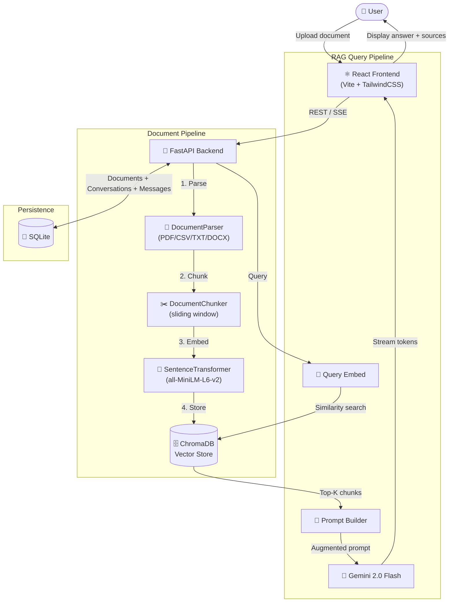

# 🚗 Vehicle Intelligence Assistant

> **AI-powered RAG system for vehicle maintenance documents** — Upload your owner manuals and service guides, then ask any maintenance question in natural language.

[](https://python.org)
[](https://fastapi.tiangolo.com)
[](https://react.dev)
[](https://ai.google.dev)
[](https://www.trychroma.com)

---

## ✨ Features

| Feature | Description |
|---|---|
| 📄 **Multi-format Upload** | PDF, CSV, XLSX, DOCX, TXT support |
| 🔍 **Semantic Search** | ChromaDB + sentence-transformers embeddings |
| 🤖 **RAG Pipeline** | Gemini 2.0 Flash with context-aware answers |
| 💬 **Streaming Chat** | Real-time SSE token streaming |
| 👍 **Answer Feedback** | Thumbs up/down rating on every answer |
| 📊 **Analytics Dashboard** | Satisfaction rate + document status charts |
| 🚗 **Vehicle Metadata** | Auto-detects make/model from document names |
| 👁️ **Document Preview** | View parsed content before querying |
| ⬇️ **Export Conversations** | Download any chat as Markdown |
| 🌙 **Dark Mode** | Full system-aware theme |
| 📱 **Responsive UI** | Works on mobile and desktop |
| 🐳 **Docker Ready** | One-command full-stack deployment |

---

## 🏗️ Architecture



---

## 🛠️ Tech Stack

| Layer | Technology |
|---|---|
| **Frontend** | React 19, Vite 6, TailwindCSS, React Router v6 |
| **UI Components** | Lucide Icons, React Markdown, React Hot Toast |
| **Backend** | FastAPI, Python 3.11, uvicorn |
| **Database** | SQLite via aiosqlite (async) |
| **Vector Store** | ChromaDB (persistent, local) |
| **Embeddings** | sentence-transformers (`all-MiniLM-L6-v2`) |
| **LLM** | Google Gemini 2.0 Flash (REST API) |
| **Deployment** | Docker + nginx |

---

## 🚀 Quick Start (Local Development)

### Prerequisites
- Python 3.11+
- Node.js 20+
- A [Google Gemini API key](https://aistudio.google.com/apikey) (free tier works)

### 1. Clone the repository
```bash
git clone https://github.com/dipti-2211/Vechicle-Rag.git
cd Vechicle-Rag
```

### 2. Set up the backend
```bash
cd backend
python -m venv venv
source venv/bin/activate          # Windows: venv\Scripts\activate
pip install -r requirements.txt

# Configure environment
cp .env.example .env
# Edit .env and add your GEMINI_API_KEY
```

### 3. Start the backend
```bash
uvicorn app.main:app --reload --port 8000
# API docs available at: http://localhost:8000/docs
```

### 4. Set up the frontend
```bash
cd ../frontend
npm install
cp .env.example .env              # VITE_API_URL=http://localhost:8000
npm run dev
# App available at: http://localhost:5173
```

---

## 🐳 Docker Quick Start

```bash
# 1. Add your API key
cp backend/.env.example backend/.env
# Edit backend/.env → set GEMINI_API_KEY=your_key

# 2. Build and run
docker compose up --build

# Access:
#   Frontend:  http://localhost
#   API:       http://localhost:8000
#   API Docs:  http://localhost:8000/docs
```

---

## 📡 API Reference

### Documents
| Method | Endpoint | Description |
|---|---|---|
| `GET` | `/api/documents` | List all documents |
| `POST` | `/api/documents` | Upload a document |
| `GET` | `/api/documents/stats` | Upload stats |
| `GET` | `/api/documents/{id}` | Get document details |
| `GET` | `/api/documents/{id}/status` | Poll processing status |
| `GET` | `/api/documents/{id}/preview` | Preview parsed content |
| `DELETE` | `/api/documents/{id}` | Delete document |

### Chat & RAG
| Method | Endpoint | Description |
|---|---|---|
| `GET` | `/api/chat/conversations` | List conversations |
| `POST` | `/api/chat/conversations` | Create conversation |
| `GET` | `/api/chat/conversations/{id}/messages` | Get messages |
| `POST` | `/api/chat/ask` | Ask a question (standard) |
| `POST` | `/api/chat/stream` | Ask with SSE streaming |
| `GET` | `/api/chat/conversations/{id}/export` | Export as Markdown |
| `PATCH` | `/api/chat/messages/{id}/rating` | Rate an answer |
| `GET` | `/api/chat/analytics` | Analytics summary |

### System
| Method | Endpoint | Description |
|---|---|---|
| `GET` | `/health` | Health check |
| `GET` | `/docs` | Swagger UI |

---

## 📁 Project Structure

```
Vechicle-Rag/
├── backend/
│   ├── app/
│   │   ├── main.py              # FastAPI app factory + lifespan
│   │   ├── config.py            # Settings (pydantic-settings)
│   │   ├── models/
│   │   │   ├── database.py      # SQLite async manager
│   │   │   └── schemas.py       # Pydantic request/response models
│   │   ├── routes/
│   │   │   ├── documents.py     # Document upload + pipeline
│   │   │   └── chat.py          # Chat + RAG + feedback + analytics
│   │   ├── services/
│   │   │   ├── document_service.py  # Document CRUD
│   │   │   ├── chat_service.py      # Conversation + message CRUD
│   │   │   ├── rag_service.py       # RAG pipeline + streaming
│   │   │   ├── parser.py            # PDF/CSV/TXT/DOCX parsing
│   │   │   ├── chunker.py           # Text chunking
│   │   │   ├── vector_store.py      # ChromaDB wrapper
│   │   │   └── metadata_extractor.py # Vehicle name detection
│   │   └── prompts/
│   │       └── templates.py     # RAG prompt builder
│   ├── requirements.txt
│   ├── .env.example
│   └── Dockerfile
│
├── frontend/
│   ├── src/
│   │   ├── main.jsx             # React entry point (+ ErrorBoundary)
│   │   ├── App.jsx              # Router + lazy-loaded pages
│   │   ├── pages/
│   │   │   ├── Dashboard.jsx    # Stats + analytics charts
│   │   │   ├── Upload.jsx       # Drag & drop upload
│   │   │   ├── Documents.jsx    # Document table + preview modal
│   │   │   ├── Chat.jsx         # Streaming chat + feedback
│   │   │   ├── Settings.jsx     # App settings
│   │   │   └── NotFound.jsx     # 404 page
│   │   ├── components/
│   │   │   ├── ErrorBoundary.jsx
│   │   │   └── ui/
│   │   ├── contexts/
│   │   │   └── ThemeContext.jsx  # Dark/light mode
│   │   ├── hooks/
│   │   │   └── useDocumentPolling.js
│   │   └── api/
│   │       └── axios.js         # API client
│   ├── .env.example
│   ├── nginx.conf
│   └── Dockerfile
│
├── docker-compose.yml
├── .dockerignore
└── README.md
```

---

## 🧪 Development Scripts

```bash
# Backend
uvicorn app.main:app --reload     # Dev server with hot-reload
python -m pytest                  # Run tests (if configured)

# Frontend
npm run dev                       # Dev server (http://localhost:5173)
npm run build                     # Production build
npm run lint                      # oxlint check
npm run preview                   # Preview production build
```

---

## 🔑 Environment Variables

### Backend (`backend/.env`)

| Variable | Required | Default | Description |
|---|---|---|---|
| `GEMINI_API_KEY` | ✅ Yes | — | Google Gemini API key |
| `GEMINI_MODEL` | No | `gemini-2.0-flash` | LLM model name |
| `DATABASE_PATH` | No | `./data/app.db` | SQLite file path |
| `UPLOAD_DIR` | No | `./data/documents` | File upload directory |
| `VECTOR_DB_PATH` | No | `./data/vectordb` | ChromaDB directory |
| `EMBEDDING_MODEL` | No | `all-MiniLM-L6-v2` | Embedding model |
| `TOP_K_RESULTS` | No | `5` | RAG top-k chunks |
| `CORS_ORIGINS` | No | `http://localhost:5173` | Allowed origins |

### Frontend (`frontend/.env`)

| Variable | Required | Default | Description |
|---|---|---|---|
| `VITE_API_URL` | No | `http://localhost:8000` | Backend base URL |

---

## 📋 Milestones

| # | Milestone | Status |
|---|---|---|
| 1 | Project Foundation & Setup | ✅ |
| 2 | FastAPI Backend + SQLite | ✅ |
| 3 | Document Upload API | ✅ |
| 4 | Document Parsing (PDF/CSV/TXT/DOCX) | ✅ |
| 5 | Text Chunking Pipeline | ✅ |
| 6 | Vector Store (ChromaDB + Embeddings) | ✅ |
| 7 | RAG Pipeline (Gemini Integration) | ✅ |
| 8 | Chat UI + Conversation Management | ✅ |
| 9 | Production Polish (polling, search, code-split) | ✅ |
| 10 | Streaming Chat (SSE) + Vehicle Metadata | ✅ |
| 11 | Answer Feedback + Analytics Dashboard | ✅ |
| 12 | Conversation Export + Document Preview | ✅ |
| 13 | Final Production Hardening | ✅ |

---

## 📄 License

This project was built as an internship project. All rights reserved.
